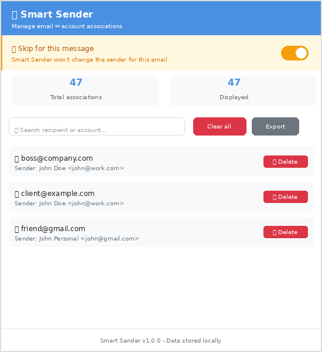

# 📧 Smart Sender

> A modern Thunderbird addon that automatically remembers which email account you use for each recipient and switches the sender if needed.

[](https://www.thunderbird.net/)
[](https://opensource.org/licenses/MIT)
[](https://github.com/YOUR_USERNAME/smart-sender/releases)

## ✨ Features

- 🧠 **Automatic Learning** - Remembers which account you use for each recipient
- ⚡ **Instant Switching** - Automatically changes sender when composing to known recipients
- 🎯 **Smart Matching** - Works with To, Cc, and Bcc fields
- 🔒 **Privacy First** - All data stored locally, never leaves your computer
- 🎛️ **Manual Control** - Toggle switch to skip auto-switching for specific messages
- 🗂️ **Easy Management** - Visual interface to view, search, and delete associations
- 💾 **Export Data** - Backup your associations as JSON
- 🚀 **Modern & Secure** - Built with WebExtension APIs, no `innerHTML` vulnerabilities

## 📸 Screenshots


*Manage associations and toggle auto-switching per message*


*Automatic sender switching in action*

## 🚀 Installation

### From Thunderbird Add-ons (Recommended)

1. Open Thunderbird
2. Go to **Add-ons and Themes** (`Ctrl+Shift+A`)
3. Search for **"Smart Sender"**
4. Click **Install**

### Manual Installation

1. Download `smart-sender.xpi` from [Releases](https://github.com/YOUR_USERNAME/smart-sender/releases)
2. In Thunderbird: **Add-ons** → ⚙️ → **Install Add-on From File**
3. Select the downloaded `.xpi` file

### From Source

```bash
git clone https://github.com/YOUR_USERNAME/smart-sender.git
cd smart-sender
zip -r smart-sender.xpi * -x "*.git*" "*.svg" "screenshots/*"
```

Then install the `.xpi` file in Thunderbird.

## 📖 How It Works

### First Time
1. Compose an email to `boss@company.com`
2. Use your work account `you@work.com`
3. Send ✅
4. **Smart Sender learns:** `boss@company.com` → `you@work.com`

### Next Time
1. Start composing to `boss@company.com`
2. Smart Sender **automatically switches** to `you@work.com` ⚡
3. No interruption, just keep writing!

### Managing Associations

Click the Smart Sender button in the compose toolbar to:
- 📊 View all learned associations
- 🔍 Search by recipient or account
- 🗑️ Delete individual or all associations
- 💾 Export data as JSON
- ⏸️ Toggle "Skip for this message" to temporarily disable auto-switching

## 🛠️ Development

### Prerequisites

- Thunderbird 128+
- Basic knowledge of JavaScript and WebExtensions

### Project Structure

```
smart-sender/
├── manifest.json         # Addon configuration
├── background.js         # Core logic (learning & switching)
├── popup.html           # Management UI
├── popup.js             # Popup logic
├── icons/               # Addon icons
├── README.md            # Documentation
└── INSTALLATION.md      # User guide
```

### Building

```bash
# Create XPI package
zip -r smart-sender.xpi * -x "*.git*" "*.svg" "screenshots/*"
```

### Debugging

1. Open Thunderbird
2. **Tools** → **Developer Tools** → **Debug Add-ons**
3. Load `manifest.json` as temporary add-on
4. Open **Debug Console** to view logs (start with "Smart Sender:")

### Architecture

**Learning Phase:**
```
User sends email → onBeforeSend listener
  → Extract recipients (To/Cc/Bcc)
  → Save {recipient: identityId} mapping
  → Store in browser.storage.local
```

**Switching Phase:**
```
User types recipient → Polling every 2s
  → Look up recipient in stored mappings
  → If found + different from current → Switch identity
  → Skip if "Skip toggle" is ON for this tab
```

## 🤝 Contributing

Contributions are welcome! Please feel free to submit a Pull Request.

### Guidelines

- Follow existing code style
- No `innerHTML` - use DOM methods for security
- Test with Thunderbird 128+
- Update documentation if needed

### Reporting Issues

Found a bug? [Open an issue](https://github.com/YOUR_USERNAME/smart-sender/issues/new) with:
- Thunderbird version
- Steps to reproduce
- Expected vs actual behavior
- Console logs (if applicable)

## 🔒 Privacy & Security

- ✅ **All data stored locally** - nothing sent to external servers
- ✅ **No tracking or analytics**
- ✅ **No innerHTML** - passes Mozilla security review
- ✅ **Minimal permissions** - only what's needed
- ✅ **Open source** - audit the code yourself

## 📋 Permissions Used

- `accountsRead` - Read your email accounts/identities
- `compose` - Access compose windows to switch sender
- `messagesRead` - Read recipient addresses
- `storage` - Save associations locally
- `downloads` - Export associations as JSON

## 🐛 Troubleshooting

### Addon doesn't switch accounts
- Check you've sent at least one email to that recipient
- Verify addon is enabled in Add-ons manager
- Check Debug Console for errors

### Want to reset all associations
- Open popup → Click "Clear all" button
- Or manually: Close Thunderbird → Delete `storage` folder in profile

### Toggle doesn't work
- Make sure you're clicking it in an active compose window
- It's per-message - doesn't affect other compose windows

## 📝 Changelog

### v1.0.0 (2026-02-17)
- ✨ Initial release
- 🧠 Automatic learning from sent emails
- ⚡ Automatic sender switching
- 🎛️ Skip toggle for individual messages
- 🗂️ Association management popup
- 💾 Export functionality
- 🔍 Search and filter

## 📄 License

MIT License - see [LICENSE](LICENSE) file for details

## 🙏 Acknowledgments

Inspired by the classic [Virtual Identity](https://github.com/absorb-it/Virtual-Identity) extension, completely rewritten for modern Thunderbird using WebExtension APIs.

## 📧 Contact

- **Issues:** [GitHub Issues](https://github.com/YOUR_USERNAME/smart-sender/issues)
- **Email:** your.email@example.com

---

**Made with ❤️ for the Thunderbird community**

*If you find this addon useful, consider starring ⭐ the repository!*
